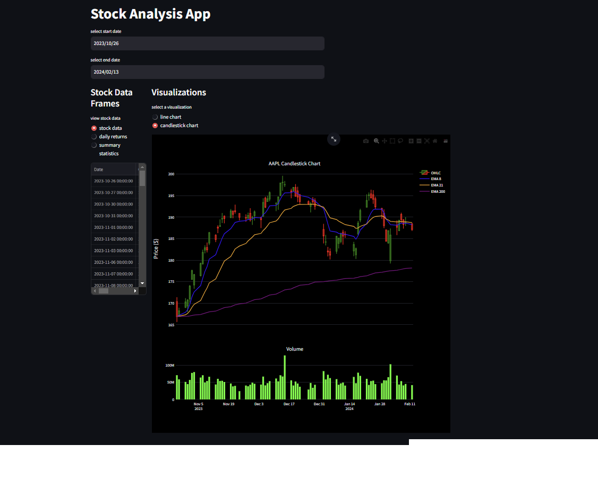

# project-3

# Stock Analysis App


---
### deploy streamlit app:

https://ticker-tracker.streamlit.app/

---

## Project Overview

This Streamlit application provides an interactive platform for the analysis of stock data, leveraging `yfinance` to fetch real-time financial data. It aims to simplify stock market analysis by offering detailed visualizations and statistical insights, thus serving as a valuable tool in the fintech domain by aiding in investment decision-making.

## Technical Requirements

### Software Version Control

- **GitHub Repository**: Our project is hosted on GitHub, ensuring version control and collaborative development.
- **Commit Practices**: We adhere to frequent commits with detailed messages that accurately reflect each update for easy tracking of project progression.
- **Repository Organization**: Our repository is meticulously organized, containing all relevant project files and documentation to ensure clarity and accessibility.

### Data Collection and Preparation

- **Data Source**: Real-time stock data is fetched using the `yfinance` library, demonstrating our capability to collect data from APIs.
- **Data Preparation**: The data is cleaned and prepared within the application using `pandas`, making it ready for analysis and visualization.

### Development

- **Streamlit Application**: We've developed an interactive Streamlit application as the core of our project, showcasing our proficiency in creating user-friendly financial analysis tools.
- **Python Modules**: The project incorporates custom Python functions for data fetching, preparation, and visualization, illustrating our ability to modularize code.
- **Visualizations and Metrics**: We provide interactive candlestick charts and summary statistics, offering comprehensive insights into stock performance.
- **New Technology**: The project utilizes `plotly` for advanced data visualization, a library not covered in our coursework, demonstrating our initiative to integrate new technologies.

## Documentation

- **Code Comments**: Our code is extensively commented, ensuring understandability and ease of maintenance.
- **Project Overview**: This README.md provides a concise overview of the project, clearly stating its purpose and relevance to fintech.
- **Installation and Usage Instructions**: Detailed instructions guide users on setting up and using the application, ensuring accessibility for all users.
- **Application Examples**: We include examples and visualizations generated by the application, offering a clear depiction of its capabilities and output.

### Installation and Setup Instructions

#### 1. Install Python

Ensure you have Python installed on your system. Python 3.6 or newer is required for this application. You can download Python from the official website: [https://www.python.org/downloads/](https://www.python.org/downloads/).

#### 2. Download the Application

Download the Streamlit application code to your local machine. You can do this by cloning the GitHub repository or downloading the file directly if provided.

If cloning from GitHub:
```bash
git clone <repository_url>
cd <repository_folder>
```

#### 3. Create a Virtual Environment (Optional but Recommended)

Creating a virtual environment is recommended to avoid conflicts with other Python projects or libraries. Use the following commands to create and activate a virtual environment:

For macOS/Linux:
```bash
python3 -m venv stock-analysis-env
source stock-analysis-env/bin/activate
```

For Windows:
```bash
python -m venv stock-analysis-env
.\stock-analysis-env\Scripts\activate
```

#### 4. Install Required Libraries

Install the required Python libraries using `pip`. These libraries include `streamlit`, `yfinance`, `pandas`, and `plotly`. Run the following command:

```bash
pip install streamlit yfinance pandas plotly
```

### Running the Application

After installing all necessary dependencies, you can run the application using Streamlit. Navigate to the directory containing the application file (`streamlit.py`) and run:

```bash
streamlit run streamlit.py
```

### Using the Application

1. **Access the App**: Upon running the command, Streamlit will start the application and open it in your default web browser. If it doesn't automatically open, you can manually navigate to the URL provided in the terminal (usually `http://localhost:8501`).

2. **Enter Stock Ticker**: Use the sidebar to input the stock ticker symbol for the company you're interested in (e.g., `AAPL` for Apple Inc.).

3. **Select Date Range**: Choose the start and end dates for the data analysis. The app will fetch historical stock data for this period.

4. **View Data and Visualizations**: The application provides options to view the stock data, daily returns, and summary statistics. Additionally, you can select between viewing a line chart or a candlestick chart for the selected stock.

5. **Interact with Visualizations**: Explore the candlestick chart, which includes key indicators like EMAs (Exponential Moving Averages). Use the interactive features provided by Plotly within the Streamlit app to zoom in/out and hover over specific data points for more details.

### Troubleshooting

- If you encounter any issues with missing libraries, ensure all required packages are installed by re-running the `pip install` command.
- For any errors related to `streamlit` commands, verify that Streamlit is installed correctly by running `streamlit --version` in your terminal.
- Ensure your internet connection is active, as the application requires it to fetch stock data from `yfinance`.

Enjoy exploring stock data with your interactive Streamlit application!

## Presentation Requirements

### Executive Summary

- **Project Goals**: Our goal is to democratize financial analysis by providing an easy-to-use application for stock market analysis, catering to both novices and seasoned investors.

### Approach

- **Fintech Relevance**: This project embodies the fintech ethos by leveraging technology to make financial markets more accessible and understandable.
- **Development Process**: We detail our iterative approach to application development, from initial data collection to the integration of interactive visualizations.
- **Challenges and Resolutions**: We discuss unexpected hurdles encountered during development and how we overcame them, highlighting our problem-solving capabilities.

### Results and Conclusions

- **Analysis Outcomes**: The application successfully delivers real-time stock analysis, empowering users with actionable insights into market trends.
- **Visual Support**: We incorporate screenshots and charts from the application to visually substantiate our findings and conclusions.

### Next Steps

- **Future Enhancements**: Potential enhancements include the integration of machine learning models for predictive analysis and expanding the dataset to include global stock exchanges.
- **Further Research**: Given more time, we would explore the application of natural language processing (NLP) to analyze sentiment from financial news and its impact on stock prices.
